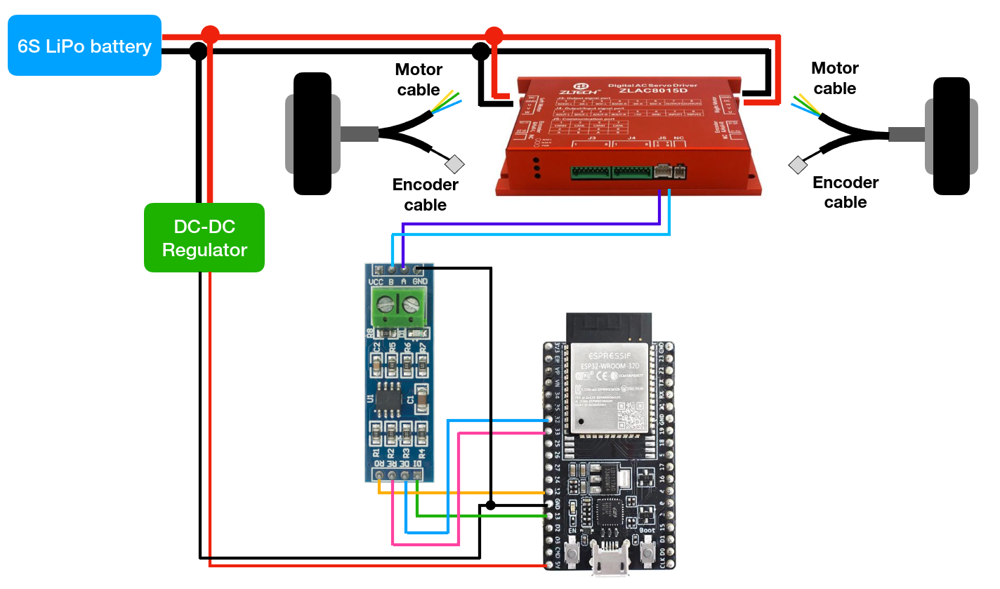

# ZLAC8015D ESP32-Arduino library

This library is using ModbusMaster to communicate with ZLAC8015D motor driver to control and get feedback of motor.

## Dependencies

- [ModbusMaster](https://github.com/4-20ma/ModbusMaster) library

## Hardware

- ZLAC8015D motor driver and two motors
- ESP32
- MAX485 TTL-RS485 converter
- 5V DCDC regulator 

## Note

The ZLAC8015D could also be used in position control and torque control, but at this moment my library could only support velocity control. 